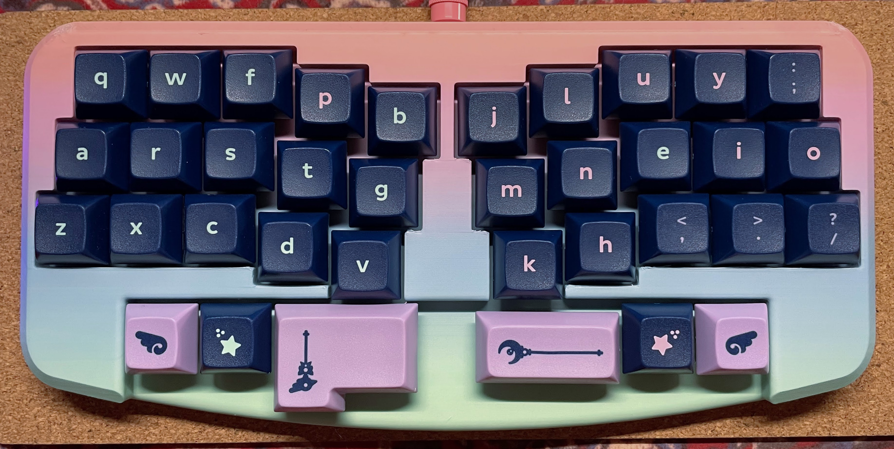

★ 10 columns in a modified Katana layout

★ inner columns are moved down a bit for an ergo-light curve

★ spacebar layout supports ISO enter for either or both bars

### This repo should contain:
- KiCAD 8 files for the PCB
- production files (gerbers, JLC BOM, CPL, etc) -- definitely double check the part numbers/availability before committing to fabrication! 
- a .stl for the case
- firmware in both qmk/vial and zmk, and source for each

### To build your own zmk keymap
Fork [this repo](https://github.com/sbkeebs/sprig-zmk-config), and enable Actions. Modify `config/boards/arm/sprig/sprig.keymap`. Let it build (click Actions at the top of your repo).

ZMK Studio is not yet integrated!

This was built upon NCKiser's [STM32F072 template](https://github.com/NCKiser/STM32F072_template) as one of my first projects with an integrated MCU. If you'd like to get started with your own keyboard, [this video](https://www.youtube.com/watch?v=kGKN8SGkUD0) is a great place to start.

